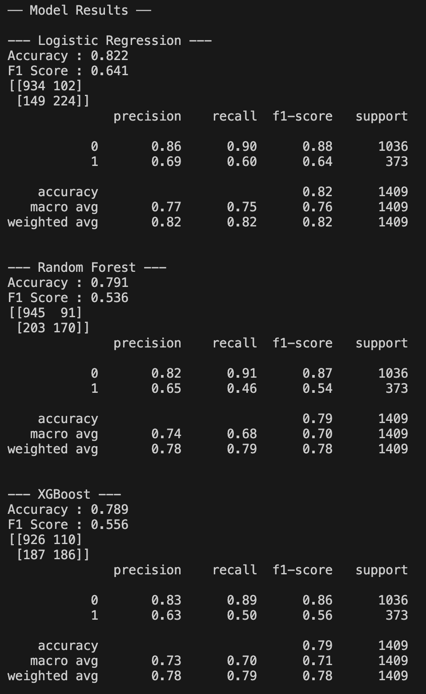

# Customer Churn Prediction

Predicts which telecom customers are likely to cancel their service using machine learning. Trains and compares three classification models on real-world data.

## How it works

1. Loads and cleans the Telco Customer Churn dataset (handles missing values, encodes categorical features)
2. Splits data 80/20 into training and test sets
3. Trains Logistic Regression, Random Forest, and XGBoost models
4. Evaluates each model with accuracy, F1 score, confusion matrix, and classification report

## Tech Stack

- **Python** - Pandas, NumPy
- **Scikit-learn** - Logistic Regression, Random Forest, preprocessing, metrics
- **XGBoost** - gradient boosted classifier

## Dataset

Telco Customer Churn - download from [Kaggle](https://www.kaggle.com/datasets/blastchar/telco-customer-churn) and place in the `/data` folder.

## Results

| Model               | Accuracy | F1 Score |
|---------------------|----------|----------|
| Logistic Regression | 82.2%    | 0.641    |
| Random Forest       | 79.6%    | 0.542    |
| XGBoost             | 78.9%    | 0.556    |

Logistic Regression performed best on this dataset.

## How to run

```bash
pip install -r requirements.txt
python main.py
```

## Output

